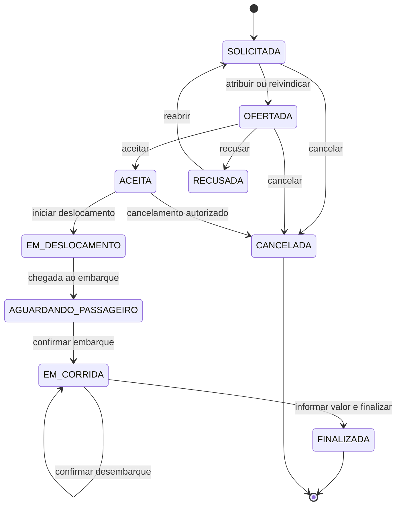

# Fluxo de corridas

## Maquina de estados

Toda transicao e validada pelo backend, atualiza o timestamp correspondente, cria um registro em
`corrida_eventos` e grava auditoria na mesma transacao. Depois do commit, o estado confirmado e
emitido por Socket.IO para os clientes autorizados que acompanham a corrida.

## Regras por perfil

- `GESTOR`: ve todas as corridas da empresa, solicita, atribui prestador, altera uma oferta,
  reabre recusas e cancela ate o estado `ACEITA`.
- `GERENTE`: ve corridas dos centros de custo autorizados, solicita para funcionarios ativos
  desses centros e cancela apenas `SOLICITADA` ou `OFERTADA`.
- `PRESTADOR`: ve as proprias corridas e, quando disponivel, corridas `SOLICITADA` sem prestador.
  Pode aceitar, recusar e executar somente corridas destinadas ou reivindicadas por ele.

## Aceite concorrente

O backend bloqueia a corrida e o prestador com `SELECT ... FOR UPDATE`. Uma corrida disponivel pode
ser reivindicada por apenas um prestador, e o mesmo prestador nao consegue aceitar duas corridas
ativas simultaneamente.

Ao aceitar, o prestador fica indisponivel. Ao finalizar ou ao ter uma corrida `ACEITA` cancelada,
volta a ficar disponivel. A disponibilidade nao pode ser ativada enquanto houver corrida ativa.

## Valores e historico

- Valores entram e saem como texto decimal e sao persistidos em `NUMERIC(12, 2)`.
- O desembarque deve ser confirmado antes da finalizacao.
- Recusas permanecem em `RECUSADA` ate um gestor reabrir a corrida.
- Nenhum evento ou corrida e excluido fisicamente.
